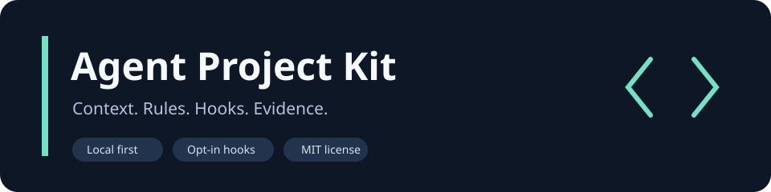
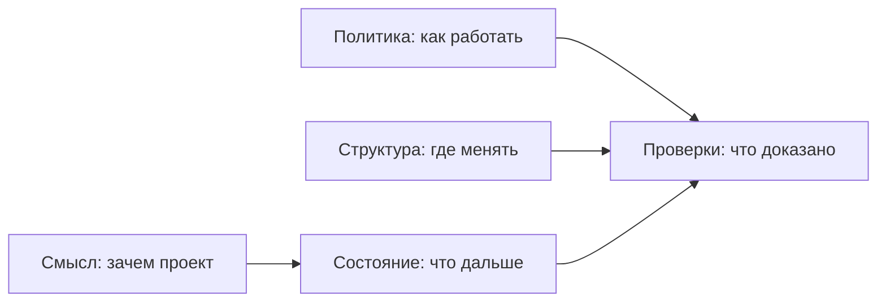

# Agent Project Kit



[](https://github.com/kostyaP-hub/agent-project-kit/actions/workflows/ci.yml)

[](LICENSE)

**Чтобы AI-агент понимал проект, сохранял контекст и проверял свою работу.**

Практический набор стандартов, шаблонов, проверок и добровольно подключаемых хуков.
Подходит для личных проектов и небольших команд. Без облачного сервиса, платных API,
скрытой телеметрии и обязательной базы знаний.

[Начать за 5 минут](docs/quickstart.md) · [Стандарт](standard/01-PROJECT-STANDARD.md) ·
[Хуки](docs/hooks.md) · [Наши лайфхаки](docs/playbook.md) · [English](docs/overview.en.md)

| Проблема | Что помогает |
|---|---|
| Новый агент снова расспрашивает, что за проект | `AGENTS.md` и компактный `project.state` |
| Правила разошлись между инструментами | Один источник правил, проверка дрейфа |
| «Готово» сказано без проверки | Команда проверки и результат в отчёте |
| Секрет оказался в коммите | Локальный Gitleaks и проверка истории в CI |
| Каждый PR меняет одни строки состояния | Единственный писатель state на default-ветке |
| Полезный хук сломал существующую настройку | Opt-in установка, отказ при конфликте, безопасное удаление |

## Как устроено



Каждый факт хранится в одном месте. Остальные документы ссылаются на него.
Описание проекта может жить прямо в репозитории; отдельный Vault не требуется.

## Попробовать

Требуются Python 3.11+ и Git. Хуки дополнительно требуют Gitleaks 8.30.1+.
Команды выполняются из клона этого репозитория.

```bash
python3 kit/scripts/ctx-scaffold.py /path/to/your-project --project your-project --no-justfile
python3 kit/scripts/project-state-validate.py --repo /path/to/your-project
python3 kit/scripts/ctx-lint.py /path/to/your-project --mode=block
```

После scaffold нужно **создать и заполнить** `project.state` из шаблона и проектные
правила. Между первой и второй командой пройдите [quickstart](docs/quickstart.md).
Существующие файлы сохраняются; для существующего `AGENTS.md` используйте `--additive`.

Хуки включаются отдельно, после знакомства с кодом:

```bash
python3 kit/scripts/install-hooks.py --repo /path/to/your-project --dry-run
python3 kit/scripts/install-hooks.py --repo /path/to/your-project
```

[Полная установка и удаление](docs/hooks.md). Пакет ничего не устанавливает при клонировании.

## Что внутри

| Каталог | Содержимое |
|---|---|
| `standard/` | Стандарт, внедрение в существующие проекты, создание нового |
| `kit/rules/` | Общие правила и шаблоны правил конкретного проекта |
| `kit/scripts/` | Scaffold, lint, карта структуры, state, установка хуков |
| `kit/templates/` | `AGENTS.md`, `project.state`, решения и security-конфиги |
| `kit/examples/` | Вымышленные примеры, без рабочих данных |
| `hooks/` | Читаемые Git wrappers и пример Claude Code-конфигурации |
| `docs/playbook.md` | Приёмы из практики и объяснение, зачем они нужны |
| `kit/tests/` | Проверки инструментов и опасных сценариев установки |

## Совместимость и пределы

- CLI-инструменты работают локально на macOS и Linux. CI проверяет обе системы.
- `AGENTS.md` — переносимая политика; загрузка вложенных инструкций зависит от агента.
- Git-хуки проверяются интеграционными тестами. Формат Claude Code-хуков сверён
  с официальной документацией и проверен JSON-тестами; live-сессия Claude Code
  не входит в автоматический тестовый набор.
- Для других агентов доступны ручные команды. Автоматический адаптер для них не заявлен.
- Карта структуры извлекает главным образом Python AST. Она не доказывает архитектурные границы.
- Валидатор state читает документированное подмножество YAML, а не произвольный YAML.
- Хуки — удобство и ранняя обратная связь. CI и человеческое ревью остаются отдельными проверками.
- Проверка секретов не доказывает отсутствие всей чувствительной информации:
  перед публикацией нужен ручной просмотр. [Наш чеклист](docs/publishing.md).

## Проверить сам kit

```bash
python3 -m venv .venv
.venv/bin/python -m pip install --only-binary=:all: -r requirements-dev.txt
.venv/bin/python -m pytest -q kit/tests
python3 kit/scripts/public-check.py
```

Исходники, документы и шаблоны распространяются по [MIT](LICENSE).
Зависимости сохраняют собственные лицензии. [Как внести вклад](CONTRIBUTING.md).
