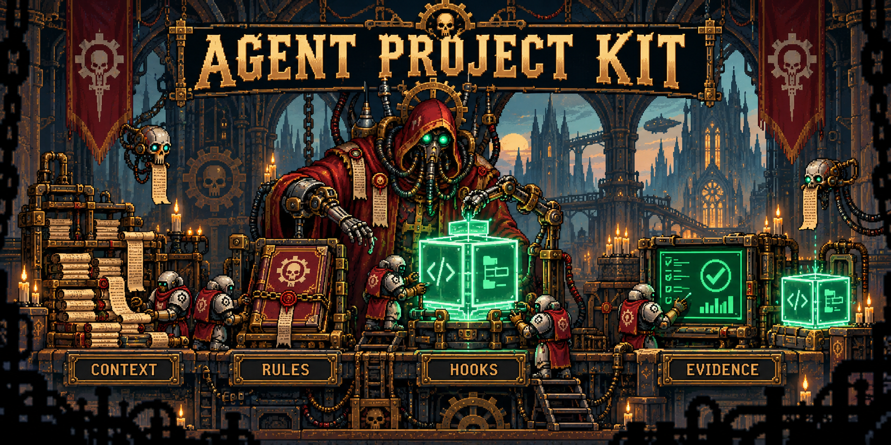

# Agent Project Kit

**Build a workspace your next AI agent can understand.**

A local-first set of project standards, templates, checks and opt-in hooks for humans
working with AI coding agents. No hosted service, paid APIs or telemetry.

Separate purpose (`docs/project.md`), current state (`project.state`), policy (`AGENTS.md`
and rules), and structure (`ARCHITECTURE.md`). Keep state small, use a Git SHA anchor,
and let only the default branch own the shared state. Feature branches keep their
next step in the PR. Verify outcomes before claiming completion.

Start with [the quickstart](quickstart.md). Run CLI tools with Python 3.11+ and Git;
opt-in hooks also require Gitleaks 8.30.1+. Installation refuses existing Git hooks and
custom hooksPath; removal preserves modified files. Claude Code hook JSON has protocol
tests, not a live-agent end-to-end certification. Other agents can use manual commands.
Windows support is not claimed. The architecture extractor is primarily Python AST.

The main documentation is in Russian. [Practical lessons](playbook.md),
[hook install/uninstall](hooks.md), [publishing checklist](publishing.md).
Code, templates and documentation are MIT-licensed.
The pixel-art forge illustrates the workflow: context → rules → hooks → evidence.
[Artwork and generation prompt](art-direction.md).
